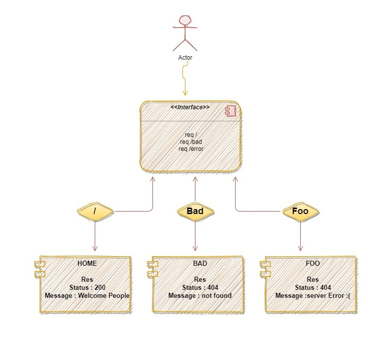

# server-deployment-practice

- [Go-to-Heroku-App-main-branch](https://ruba-server-deploy-prod.herokuapp.com/)

- [Go-to-Heroku-App-dev-branch](https://ruba-server-deploy-dev.herokuapp.com/)

- [Go-to-Github](https://github.com/RubaBanat/server-deployment-practice/actions)

- [Pull-request](https://github.com/RubaBanat/server-deployment-practice/pull/2)

---

## workflow

- `First` : 

- Deploy to Dev
- Complete an ACP on your dev branch.
- Go immediately to the repository on GitHub and open the actions tab
- You should see your tests running
- If they were passing on your local machine, they’ll also pass here
- Once your tests have passed, go to Heroku.com and look at your dev app’s Activity tab, it should show you an active deployment
When it completes, go to the Heroku app URL and open your server in the browser, you should see the same results as you saw locally.

- `Second`:

*go to production Once your dev run has completed, you have successfully deployed your application through github, with tests to an app on Heroku*

*Now, we’re going to complete the “real” deployment process*

- Go to your repository on GitHub
- Open a pull request from dev to main
- If your tests are passing, you will be able to merge this branch
- Once you merge, the tests will run again using GitHub actions
- Once the tests pass, Heroku will deploy your “main” branch to your “production” app!
- When that process completes, open your app in the browser to prove it.

---

## Data Flow Diagram

---

# THE END